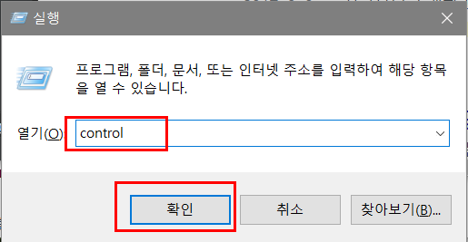
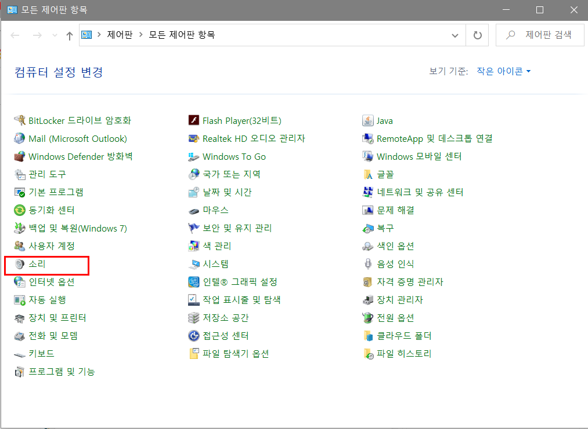
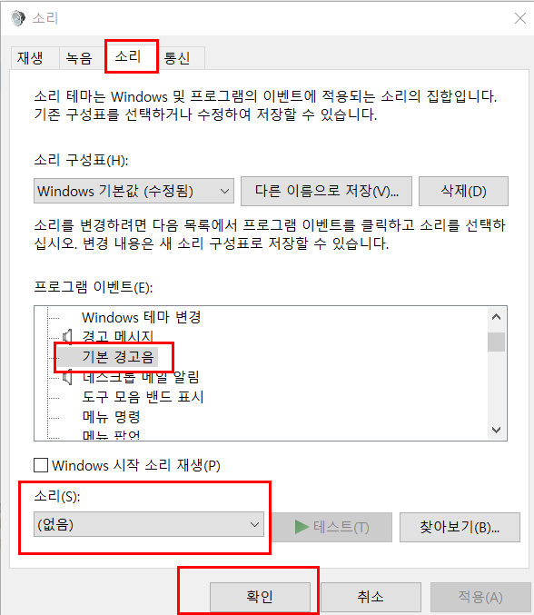

# 카카오메세지봇

## 세팅
```text
pip install -r requirements.txt
```

> [라이브러리 설치가 안될 경우 여기서 버전에 맞는것 설치](https://www.lfd.uci.edu/~gohlke/pythonlibs/)

## 실행
```text
python main.py
```

## 기능
```text
!help : 명령어 출력
!인사
!stock [Ticker] : 티커 가격 정보 출력
!info [Ticker] : 티커 정보
!history [Ticker] [Term(day)] : 현재 시점 기준으로 open, close history data
!forecast [Ticker] : 주식 프라이스
!shareholder [Ticker] : 소유주
!news [Ticker] : 최근 뉴스
!chart [Ticker] : 차트
!comprehensive [Ticker] # 통합(시간 오래걸림)
!rank [SNS] [TIME] : 최신 인기 주식 티커
[lm(Last Mover, 최근 언급량이 많아진것), wsb(Wall Street Bets), sm(Stock Market), ps(Penny Stocks), iv(Investing), s(Stocks), rps(RobinHood Penny Stocks, dt(Day Trading), spac(SPACs), ws(Weed Stocks),  tw(Twitter), gogl(Google), option(Option)]
[6h, 12h, 24h, 48h, 7d]
```

## 설명
핵심적인 파일에 대한 설명
```text
main.py 메인으로 돌아가는 파일
msg_manager.py 긁어온 메세지를 파싱하여 식별할 수 있는 데이터 형태로 변환하며, 새로운 메세지를 감지
kakaotalkchatbot.py 카톡봇의 핵심 기능 메세지를 읽고, 쓰고, 채팅방을 열고 닫는다.
scheduler.py 말그대로 스케줄을 관리한다. 주기적으로 메세지를 읽고, 이벤트를 발생시킨다. 새로운 스케줄도 다 여기서 추가
clipboard.py 윈도우 클립보드 기능을 객체화함
command.py 명령을 수행하는 메소드를 모아놓음
```

## 수정
### 방 설정
`main.py`에서 `sched = Scheduler(['방이름1', 방이름2])` 이 부분에 봇을 활성화 할 방이름을 적어줌

`kakaotalkchatbot.py`에서 `def open_chat_room(self, chat_room_name, kind="채팅방"):` 부분에 채팅방 목록에서 검색하여 열고 싶은 경우 `kind="채팅방"`, 연락처 목록에서 검색하여 열고 싶은 경우 `kind="연락처"`로 수정

### 기능 추가
`command.py`에 추가하고 싶은 기능 함수를 추가

`scheduler.py`에 있는 `def execute(self):`에 원하는 명령어를 추가하고, `command.py`에 추가했던 함수를 가져다가 실행하게 한다

`scheduler.py`에 특정 시간마다 이벤트를 실행 시키고 싶은 경우 `def __init__:` 함수 안에  `self.sched.add_job("실행시킬 함수", args=("함수인자"), 'cron', hour='19', minute='30', id='test')  # 매 xx:xx에 실행`를 수정하여 추가해준다.

`scheduler.py`에 특정 텀마다 이벤트를 실행 시키고 싶은 경우 `def __init__:` 함수 안에 `self.sched.add_job("실행시킬 함수", args=("함수인자"), trigger='cron', args=('handle_msg', room_name), second='*/1', id='test')  # 1초마다 반복`를 수정하여 추가해준다.

> [자세한 cron구문 작성법은 블로그에서 보기](https://jdm.kr/blog/2)
# 알림음 해결
텍스트를 복사할때 마다 알림음이 뜨는데, 이건 컴퓨터 설정으로 없애줘야 한다. 필요하다면 아래 설정을 따라하자



